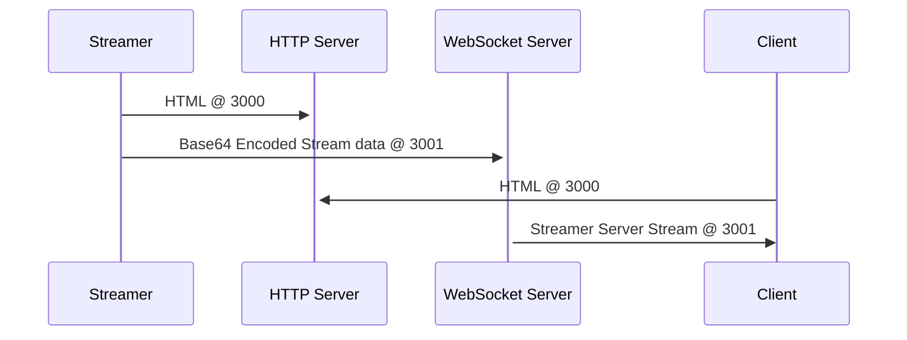
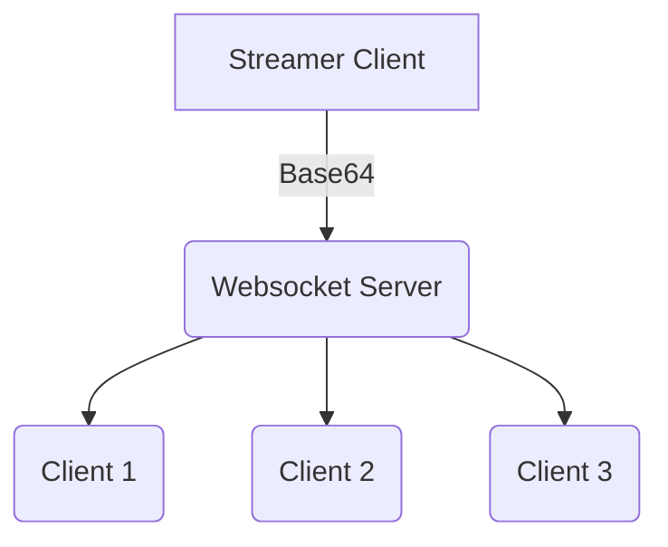

# oelle
Websocket Stream Magic Experiment

# Architecture 
## Node App

```mermaid
sequenceDiagram
    Streamer->>+HTTP Server: HTML @ 3000
    Streamer->>+WebSocket Server: Base64 Encoded Stream data @ 3001
    Client->>+HTTP Server: HTML @ 3000
    WebSocket Server->>Client: Streamer Server Stream @ 3001
```

## The Websocket Splitting 

```mermaid
  graph TD
    A[Streamer Client] -->|Base64| B(Websocket Server)
    B --> C(Client 1)
    B --> D(Client 2)
    B --> E(Client 3)
```